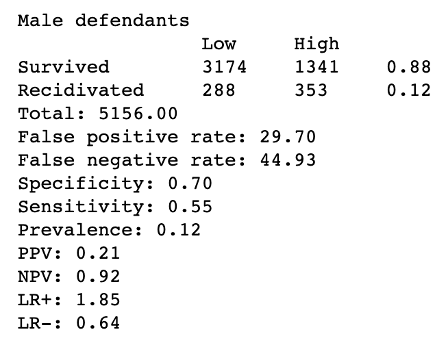
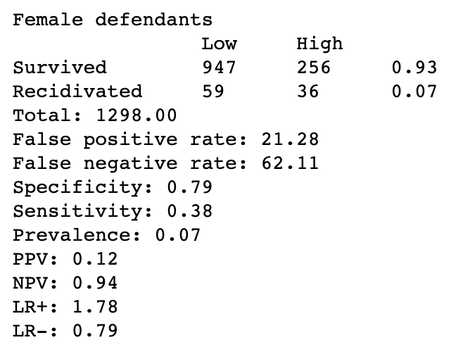

# Paper Critique on Machine Bias

In the famous article Machine Bias by Propublica, researchers explored the COMPAS software historically used to assess recidivism risk to search for proof of discrimination against minority groups. Throughout the analysis, the researchers assessed the algorithm’s treatment of white criminals versus black criminals, with a focus on those who were at risk of violent recidivism. Ultimately, the work concluded that the COMPAS algorithm was indeed treating black criminals unfairly (giving them statistically significantly higher risk scores) at a much higher rate than white criminals with a similar or worse criminal history. One method of identifying this discrimination was to compare the false positive versus false negative rates of white criminals versus black criminals in COMPAS’ risk model.

For this paper critique study, I explored the same differences of false positives and negatives. But rather than focusing on these differences between race, I was curious if there was a significant difference between gender. To test this, I used the [open-source code and datasets from the Machine Bias study](https://github.com/propublica/compas-analysis) and modified their analysis to include the differences between genders. The results were as follows:

These results show that for the COMPAS algorithm, male defendants are 40% more likely to get a higher score and not go on to commit more crimes than female defendants after 2 years. It also shows that COMPAS misclassifies female reoffenders as low risk 38.2% more often than male reoffenders. Interestingly, the results were the same for violent recidivism, which wasn’t the case in the original analysis between races.

Overall, this experiment helped me understand the paper more as I got to dive into how the researchers drew their conclusions about algorithmic discrimination. I was intrigued that the researchers didn’t mention the gender bias of the algorithm hardly at all in the article, considering it is quite prominent in the results here (though not as drastic as the racial bias). This did also make me wonder if I were to conduct a similar analysis on the COMPAS data with different fairness metrics for binary classifiers if all metrics would prove a similar level of discrimination. This is work I will be pursuing in the future!
